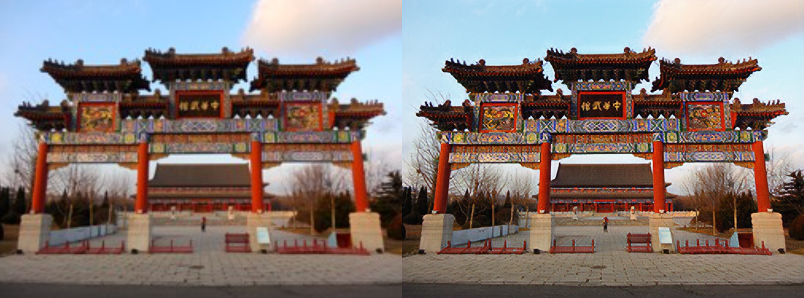
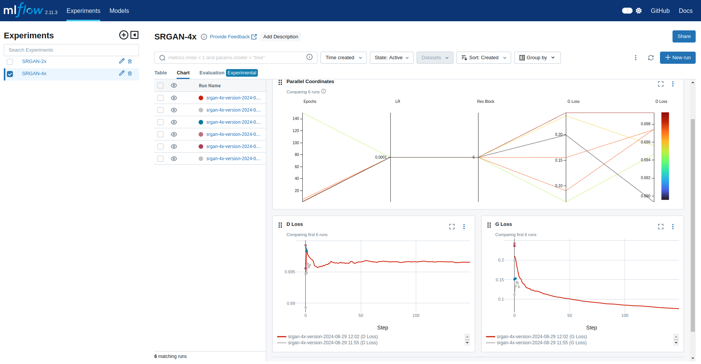

# Image-Super-Resolution-GAN


## Introduction 🚨



Super-Resolution Generative Adversarial Network (SRGAN) is a deep learning model that enhances low-resolution images by generating high-resolution versions with greater detail and sharpness. It utilizes a generative adversarial network (GAN) framework, consisting of a generator and a discriminator. The generator creates high-resolution images, while the discriminator attempts to distinguish these generated images from real high-resolution ones. To achieve visually appealing results, SRGAN employs a perceptual loss function, which combines adversarial loss with content loss derived from features of a pre-trained network.

This project is an implementation of the paper [Photo-Realistic Single Image Super-Resolution Using a Generative Adversarial Network](https://arxiv.org/abs/1609.04802v5). The model is implemented in pytorch and mlflow is used for experimentation

- GitHub link [Project-Repo](https://github.com/ananthapadmanabhan-o/Image-Super-Resolution)

- Data set linke [link](https://data.vision.ee.ethz.ch/cvl/DIV2K/)

## check out the app at [streallit app link](https://ananthapadmanabhan-o-image-super-resolution-home-n8en52.streamlit.app/)


## SRGAN Architecture


## 🚀 Installation and Setup 🔥

### STEP 01
#### 💻Clone the repository
```bash 
git clone https://github.com/ananthapadmanabhan-o/Image-Super-Resolution.git
```

### STEP 02
#### Create a virtual environment
```bash 
cd Image-Super-Resolution
python3 -m venv venv
```


### STEP 03
#### Activate the virtual environment

```bash
source venv/bin/activate
```


### STEP 04
#### Install the requirements 🔧
```bash 
pip install -r requirements.txt
```


### STEP 05
#### Model Configurations setup ⚙️. 
- Model parameters like epochs, batch size etc can be modified in the config.yaml file before training

### STEP 06
#### To Download dataset run this command
```bash

python3 data_ingestion.py
```


### STEP 07
#### To Train custom model run this command
```bash

python3 train.py
```

### STEP 08
#### For batch Inferencing
- put the images in runs/inputs then run
```bash 
python3 inference.py
```
- output images are saved in runs/outputs


### STEP 09
#### For Running Streamlit UI
```bash 
streamlit run Home.py
```

### STEP 10
#### MlFlow Experiment Tracking


```bash
mlflow server --host 127.0.0.1 --port 8080
```


